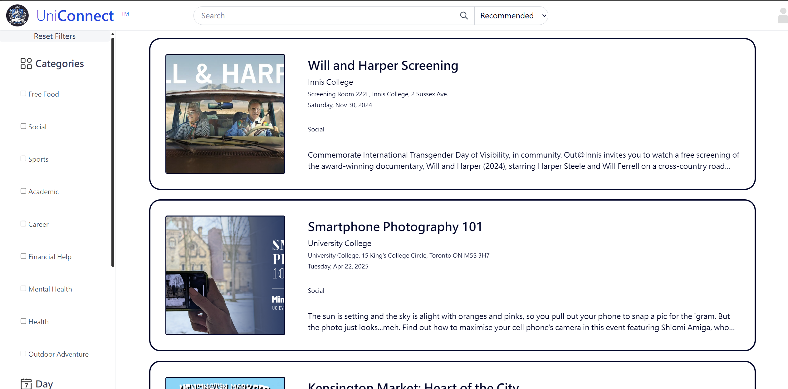
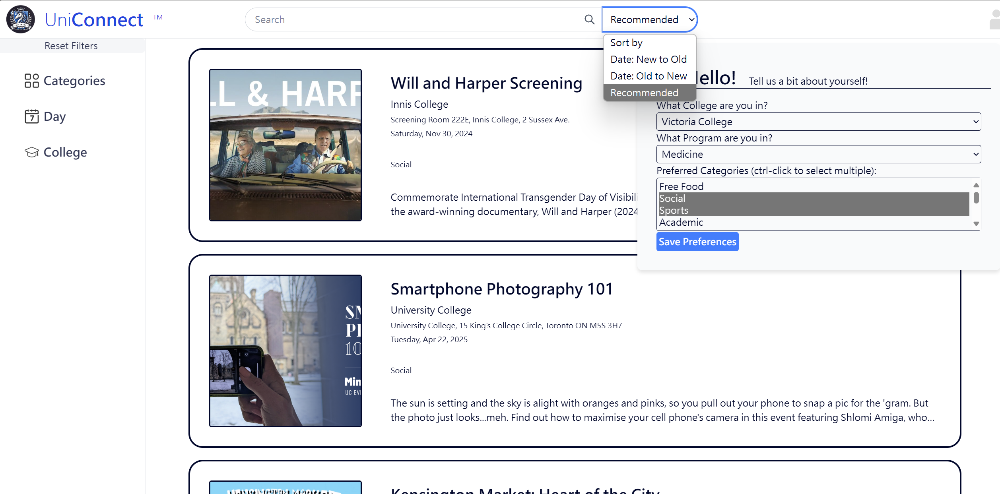
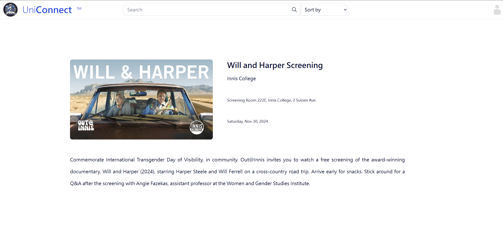

# UniConnect: College Events Summarizer for UofT

**Team Members:** Dawson Li, Sofia Borodaenko, Yi-ting Chang, Japleen Kaur  
**Course:** CSC111  
**Goal:** **Create a centralized platform for discovering and personalizing UofT college events.**

---

## 💡 Problem

UofT colleges promote events across flyers, emails, and scattered Instagram accounts. Many students miss out on opportunities due to this fragmented communication. UniConnect unifies these sources into one web platform, allowing for search, filtering, and personalized event recommendations.

---

## Overview
1. The launch page of the program, displays all events, with brief descriptions, the side bar controls the filtering system.
   
3. The header includes a search bar and a sort menu, clicking on the user icon pops up the user information form.
   
5. Specific event page, with its full image and descriptions
   

---

## 📊 Dataset

**Source:** Event pages from 6 UofT college websites:
- University College
- Woodsworth College
- Innis College
- New College
- Victoria College
- Trinity College


**Scraping Pipeline:**
- Scrape HTML via Selenium & BeautifulSoup
- Extract structured event data via LLM APIs
- Store as JSON for backend usage

---

## 🧮 Computation & Tree Structure

Events are stored in a **tree** for efficient filtering and recommendation:

---

### Core Computations
- **Scraping & Parsing**: Web scraping + LLMs to extract inconsistent HTML formats
- **Tree Building**: Events organized by weekday → college → category
- **Filtering**: Traverse tree nodes to match filters
- **Sorting**: Radix sort based on UNIX timestamps
- **Recommendation**: Score events based on user preferences

---

## 🌐 Web App (Flask)

Built with **Flask**, **HTML/CSS/JS**, **Jinja2**

### Features:
- Browse all college events
- Filter by day, category, and college
- Submit personal preferences (college, faculty, categories)
- Get personalized recommendations
- View event detail pages
- Dynamic event updates (AJAX)

---

## 🚀 How to Run

1. Install dependencies:
```bash
pip install -r requirements.txt
```

2. Run scraper to fetch latest data:
```bash
python scrapper.py
```

3. Start the Flask app:
```bash
python main.py
```
4. Open browser at:
```arduino
http://localhost:5000
```
